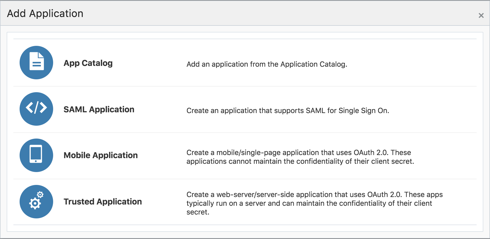
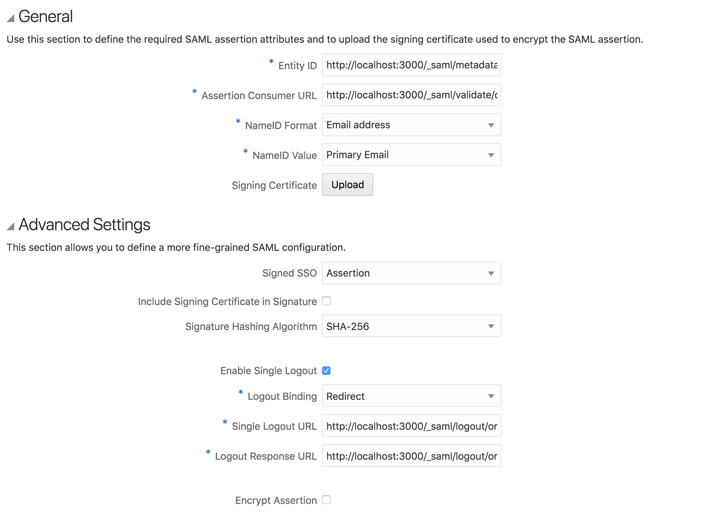
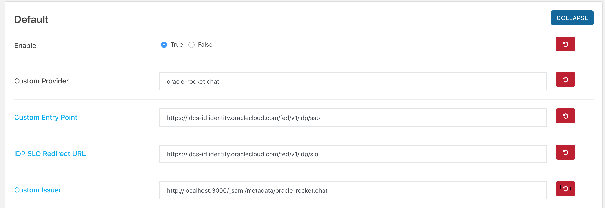

# Oracle Identity Cloud Service

## Configuring the Identity Provider

Oracle Identity Cloud Service is integrated as a SAML Identity Provider. For a detailed explanation of the SAML options on Rocket.Chat, check the [SAML Documentation](./).

## Step by Step configuration of Oracle Identity Cloud Service

### Before you begin

Before you create your IDCS application, make sure you have enabled SAML per the [SAML Documentation](./). You will need to have entered a _Custom Provider_ and a _Custom Issuer_ URL on the SAML settings page in Rocket.Chat.

**Note:** Leave the _Custom Entry Point_ and _IDP SLO Redirect URL_ values as the default values for now. We will obtain these URLs below, but you must save the SAML settings with your _Custom Issuer_ URL so you can visit this URL and obtain values that are necessary when creating the IDCS application below.

### Adding a new Application

On your Oracle Cloud Applications Dashboard, find a button to add a new application. It should open the following pop-up:

Select **SAML Application** to open the configuration wizard.

### App Details

.png>)

The only information needed on this page is the application name and URL. The URL you need to use here is the same one that is set on the _Custom Issuer_ SAML configuration field on the Rocket.Chat settings.

### SSO Configuration

To get the values for those new settings, you need to access the same _Custom Issuer_ URL that you used on the previous page. It should show an XML file similar to the one below:

On the **AssertionConsumerService** tag, you need to copy the value of the _Location_ attribute. Then paste this value on the _Assertion Consumer URL_ field on the Oracle Settings. On the **SingleLogoutService** tag, you need to copy the value of the _Location_ attribute, then paste it in the _Single Logout URL_ param of the Advanced Settings. On the same **SingleLogoutService** tag, you need to copy the value of the _ResponseLocation_ attribute, then paste it in the _Logout Response URL_ param of the Advanced Settings.

Finally, the _Entity Id_ param receives the URL of the XML file itself (same URL you used as the application URL).

Before clicking on **Finish**, click the **Download Identity Provider Metadata** button to download another XML file.

### Rocket.Chat Settings

There are two Rocket.Chat settings that need to be copied from the IDP Metadata you just downloaded: _Custom Entry Point_ and _IDP SLO Redirect URL_.

For the first one, locate the tag **md:SingleSignOnService** and copy the value of the _Location_ attribute, (ends with `/idp/sso`).

For the second param, locate the tag **md:SingleLogoutService** and copy the value of the _Location_ attribute (ends with `/idp/slo`).

There may be multiple occurrences of those tags in the XML file, so make sure that the copied URLs end with `/idp/sso` and `/idp/slo` and not `/sp/sso` and `/sp/slo`.

### Testing

Everything should be properly configured now. You can now add users to your SAML Integration app on the Oracle Dashboard and then test the login on your Rocket.Chat instance.
